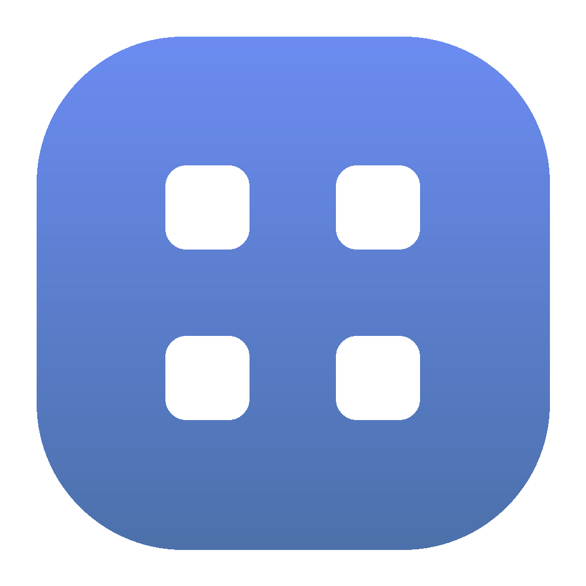

<p align="center">
  
</p>

# GlassWidgets


基于 [Avalonia 11](https://avaloniaui.net/) 的 Windows 桌面**玻璃质感小组件**。单块 AcrylicBlur 半透明面板、macOS 风格交通灯、可拖拽摆放、布局自动持久化。

> 仅支持 Windows 10/11（依赖 DWM 圆角与 `AcrylicBlur` 透明级别）。

---

## ✨ 功能

- **6 类环状小组件**：时间、CPU、内存、磁盘、网络、电量
  - 时间组件为两排加粗大数字（HH / MM）
  - 其余为「环形进度 + 中央 SVG 图标 + 实时数值」统一风格
- **小组件中心**（主界面）：列出全部组件卡片，点击即生成桌面小组件
- **macOS 风格交通灯**（左上角）：红 = 关闭应用，黄 = 仅收起中心窗口（组件保持）
- **可拖拽摆放**：拖动玻璃面板任意空白处移动组件
- **托盘图标**：收起后可从系统托盘「显示小组件中心」恢复（无托盘环境自动降级，不崩溃）
- **布局持久化**：组件位置与种类自动保存到 `%LOCALAPPDATA%/GlassWidgets/layout.json`
- **DWM 物理圆角**：窗口级圆角，玻璃铺满整个窗口矩形
- **非置顶**：组件是普通窗口，打开其它软件会被正常盖住（只在桌面层）

---

## 🧱 技术栈

| 项 | 说明 |
|----|------|
| 语言 | C# 12 / .NET 8 (`net8.0`) |
| UI 框架 | Avalonia 11.2.1（Fluent 主题 + Inter 字体） |
| 输出类型 | `WinExe`（无控制台窗口） |
| 图形 | 自定义 `DrawingContext` 绘制环形仪表、玻璃底板 |
| 系统互操作 | `BuiltInComInteropSupport`（DWM 圆角）、`System.Diagnostics.PerformanceCounter` |

---

## 📦 构建与运行

前置：安装 [.NET 8 SDK](https://dotnet.microsoft.com/download)。

```bash
# 还原依赖
dotnet restore

# 调试运行
dotnet run --project GlassWidgets.csproj

# 发布（自包含 / 单文件可选）
dotnet publish -c Release -r win-x64 --self-contained false
```

发布产物位于 `bin/Release/net8.0/win-x64/publish/`。

---

## 📥 安装

项目已提供打包好的 Windows 安装程序：**`dist/GlassWidgets-setup.exe`**（基于 Inno Setup，自包含发布，目标机无需预装 .NET 运行时）。

- 双击运行，按向导安装；默认安装到 `C:\Program Files\GlassWidgets`。
- 安装时可勾选「创建桌面快捷方式」（默认不勾）。
- 从开始菜单或桌面快捷方式启动；卸载通过「控制面板 → 卸载程序」或开始菜单的「卸载 GlassWidgets」。
- 重新生成安装包：先执行 `dotnet publish -c Release -r win-x64 --self-contained true -o publish`，再用 Inno Setup 编译脚本 `ISCC.exe GlassWidgets.iss`（输出落在 `dist/`）。

## 🖱️ 使用说明

1. 启动后自动打开**小组件中心**。
2. 点击卡片（如「CPU」）→ 桌面出现对应环状小组件。
3. 拖动组件玻璃面板的空白处可移动位置；松开后自动保存。
4. 组件右上角红点 = 关闭该组件（窗口真正消失）。
5. 中心窗口左上角：
   - 🔴 红灯 = 退出整个应用
   - 🟡 黄灯 = 仅收起中心窗口（桌面组件保持）
6. 收起后点击系统托盘图标 → 「显示小组件中心」恢复。

---

## 🗂️ 架构与目录

```
GlassWidgets/
├── App.axaml(.cs)              # 入口：初始化 WidgetManager、恢复布局、创建托盘图标
├── Program.cs                  # Main / AppBuilder
├── GlassWidgets.csproj         # 项目定义（net8.0 / WinExe / 依赖）
├── Models/
│   ├── WidgetKind.cs           # 组件枚举（Clock/Cpu/Memory/Disk/Network/Battery）
│   └── WidgetSpecs.cs          # 组件静态描述（显示名 / 图标键 / 默认尺寸）
├── Center/
│   └── WidgetCenterWindow.*    # 「小组件中心」主窗口（可拖拽、卡片列表、交通灯）
├── Widgets/
│   ├── WidgetWindow.*          # 单个浮动组件的基类窗口（透明 / 非置顶 / 关闭按钮）
│   ├── RingMetricWidget.cs     # 环状组件基类（图标 + 环形仪表 + 数值）
│   ├── ClockWidget.cs          # 时间组件（两排大数字）
│   └── Cpu/Memory/Disk/Network/BatteryWidget.cs
├── Controls/
│   ├── RingGauge.cs            # 环形进度控件
│   ├── RingClock.cs            # 表盘刻度绘制
│   └── GlassSurface.cs         # 玻璃底板（AcrylicBlur 矩形）
├── Services/
│   ├── WidgetManager.cs        # 组件生命周期中枢（生成 / 移除 / 收起 / 保存）
│   ├── LayoutStore.cs          # 布局持久化（%LOCALAPPDATA%）
│   ├── Dwm.cs                  # DWM 圆角 P/Invoke
│   └── Logger.cs               # 文件日志
├── Styles/
│   ├── LiquidGlassTheme.axaml  # 主题（mac 交通灯、大号文本等样式）
│   └── Geometries.axaml        # SVG StreamGeometry 图标资源
├── Assets/
│   ├── LogoIcon.ico            # exe/安装包文件图标（由 logo.png 同源导出，含 16~256 多档）
│   └── logo.png                # 高清源图标（1024²，README / 运行时托盘同源）
└── GlassWidgets.iss            # Inno Setup 安装脚本（编译产物 → dist/GlassWidgets-setup.exe）
```

**数据流**：`App.OnFrameworkInitializationCompleted` → `WidgetManager.Init`（创建中心为主窗口）→ `Restore`（读 `layout.json` 重建组件）→ `SetupTray`（托盘恢复入口）。

---

## 🔒 安全

- 无网络访问、无认证、无密钥/凭证硬编码。
- 依赖漏洞扫描见 [`SECURITY.md`](./SECURITY.md)；历史修复记录在 [`CHANGELOG.md`](./CHANGELOG.md)。

---

## 📄 许可证

见 [`LICENSE`](./LICENSE)（如仓库未含 LICENSE，请补充后发布）。
